# MVP: Pipeline de Dados na Nuvem — Fatores de Resultado no Campeonato Brasileiro

**Autor:** Taffarel Firmino de Paula
**Curso:** Pós-graduação em Ciência de Dados e Analytics — PUC-Rio
**Disciplina:** MVP — Engenharia de Dados
**Plataforma:** Databricks Free Edition
**Fonte:** Kaggle — Campeonato Brasileiro de Futebol

---

## Índice

1. [Contexto de Negócios e Perguntas (Etapas 2 e 4.1)](#contexto-de-negócios-e-perguntas-etapas-2-e-41)
2. [Carga dos Dados (Etapa 4.2)](#carga-dos-dados-etapa-42)
3. [Modelagem e Catálogo de Dados (Etapa 4.3)](#modelagem-e-catálogo-de-dados-etapa-43)
4. [Pipeline de Dados (Etapa 4.4)](#pipeline-de-dados-etapa-44)
5. [Qualidade de Dados (Etapa 4.5)](#qualidade-de-dados-etapa-45)
6. [Análise de Dados (Etapa 4.5)](#análise-de-dados-etapa-45)
7. [Autoavaliação](#autoavaliação)

---

## Contexto de Negócios e Perguntas (Etapas 2 e 4.1)

**Problema:** Este trabalho tem por objetivo entender quais fatores mais influenciam o resultado das partidas do Campeonato Brasileiro Série A, abordando aspectos como o mando de campo, o impacto de cartões disciplinares, o momento em que os gols são marcados, a consistência de desempenho dos times ao longo do tempo e a evolução do número de gols por partida nas últimas décadas.

**Perguntas de negócio:**
1. O mando de campo garante uma vantagem estatisticamente relevante? (% de vitórias do mandante vs. visitante vs. empates, histórico)
2. Essa vantagem de mando foi diferente durante 2020–2021 (jogos sem público) comparado aos demais anos?
3. Receber cartão vermelho antes do adversário reduz a chance de vitória do time?
4. Existe relação entre sair na frente no placar (gol nos primeiros 15-20 min) e vencer a partida?
5. Quais times têm o melhor aproveitamento como mandante e como visitante ao longo de todo o histórico?
6. A média de gols por partida mudou ao longo das temporadas?

**Dataset:** [Campeonato Brasileiro de Futebol (Kaggle)](https://www.kaggle.com/datasets/adaoduque/campeonato-brasileiro-de-futebol)

**Licença:** [GNU General Public License v2 (GPLv2)](https://www.gnu.org/licenses/old-licenses/gpl-2.0.en.html), conforme indicado na página do dataset no Kaggle. É uma licença originalmente voltada para software, mas foi a opção declarada pelo autor ao publicar o dataset. Na prática, permite copiar, usar e redistribuir os dados livremente (inclusive para fins acadêmicos), desde que qualquer redistribuição mantenha a mesma licença aberta; os dados são fornecidos "como estão", sem garantia de qualidade por parte do autor.

**Contexto dos dados brutos:** o dataset é composto por 4 arquivos CSV com granularidades diferentes: `campeonato-brasileiro-full` (9.165 linhas, uma por partida, cobrindo o Brasileirão Série A desde 2003), `campeonato-brasileiro-gols` (10.820 linhas, uma por gol marcado), `campeonato-brasileiro-cartoes` (20.953 linhas, uma por cartão aplicado) e `campeonato-brasileiro-estatisticas-full` (18.330 linhas, uma por time por partida, cobrindo um recorte mais recente de temporadas). Detalhamento completo de colunas no [catálogo de dados](docs/catalogo_de_dados.md).

---

## Carga dos Dados (Etapa 4.2)

Scripts de referência: [`notebooks/00_download_dataset.py`](notebooks/00_download_dataset.py) (opcional) e [`notebooks/01_coleta_bronze.py`](notebooks/01_coleta_bronze.py)

Os dados foram baixados do Kaggle e carregados no Volume `workspace.bronze.dados_brutos` do Unity Catalog. A partir daí, o notebook `01_coleta_bronze.py` lê cada CSV e grava como tabela Delta na camada Bronze, sem nenhuma transformação de conteúdo (apenas colunas de controle de linhagem: `_data_ingestao` e `_fonte`).

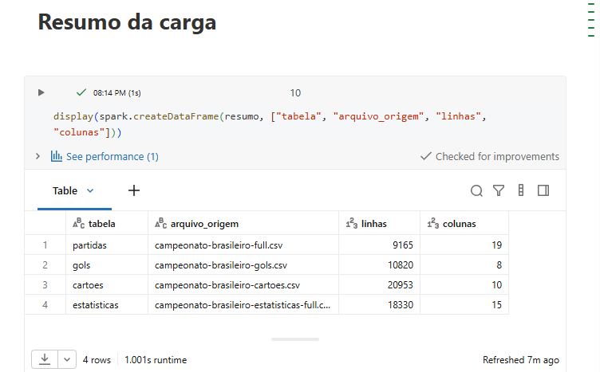

---

## Modelagem e Catálogo de Dados (Etapa 4.3)

A modelagem segue a Arquitetura Medalhão (Bronze → Silver → Gold) dentro de um único catálogo do Unity Catalog (`workspace`), com um schema por camada. Na camada Gold, optei por um modelo simples do tipo fato + agregações: `fato_partidas` é a tabela fato (uma linha por partida, já com colunas derivadas como `resultado`, `ano` e `total_gols`), e `agg_aproveitamento_mandante_visitante` e `agg_cartoes_resultado` são tabelas de agregação construídas a partir dela para responder diretamente às perguntas de negócio (aproveitamento por time/ano e impacto de cartão vermelho no resultado).

Catálogo de dados completo: [`docs/catalogo_de_dados.md`](docs/catalogo_de_dados.md)

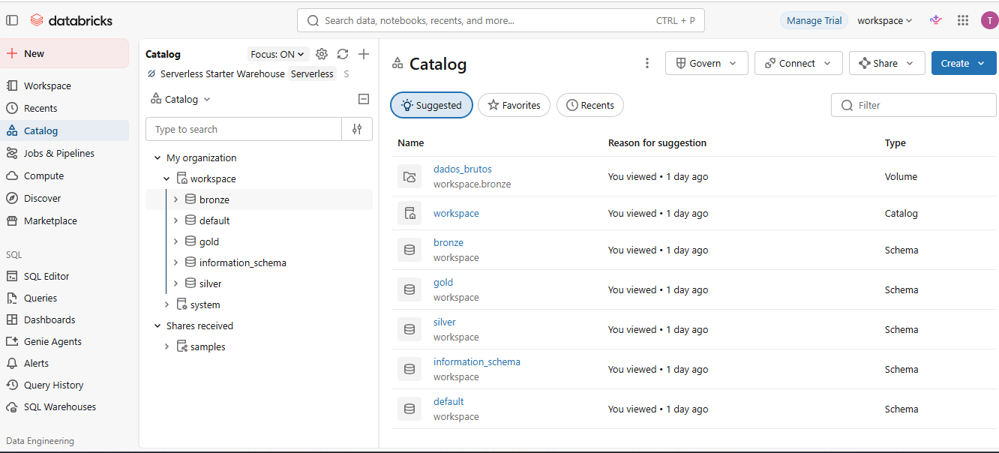

---

## Pipeline de Dados (Etapa 4.4)

O pipeline foi organizado em notebooks separados por camada, seguindo a Arquitetura Medalhão:

| Notebook | Camada | O que faz |
|---|---|---|
| [`notebooks/01_coleta_bronze.py`](notebooks/01_coleta_bronze.py) | Bronze | Lê os CSVs brutos e grava como tabelas Delta, sem transformação |
| [`notebooks/02_transformacao_silver.py`](notebooks/02_transformacao_silver.py) | Silver | Limpeza, tipagem, padronização de nomes de times, remoção de duplicatas |
| [`notebooks/03_modelagem_gold.py`](notebooks/03_modelagem_gold.py) | Gold | Tabelas modeladas (`fato_partidas`, agregações) para responder as perguntas |
| [`notebooks/04_qualidade_dados.py`](notebooks/04_qualidade_dados.py) | — | Checagens de completude, consistência, unicidade, acurácia e outliers |
| [`notebooks/05_analise.py`](notebooks/05_analise.py) | — | Responde as 6 perguntas de negócio a partir da camada Gold |

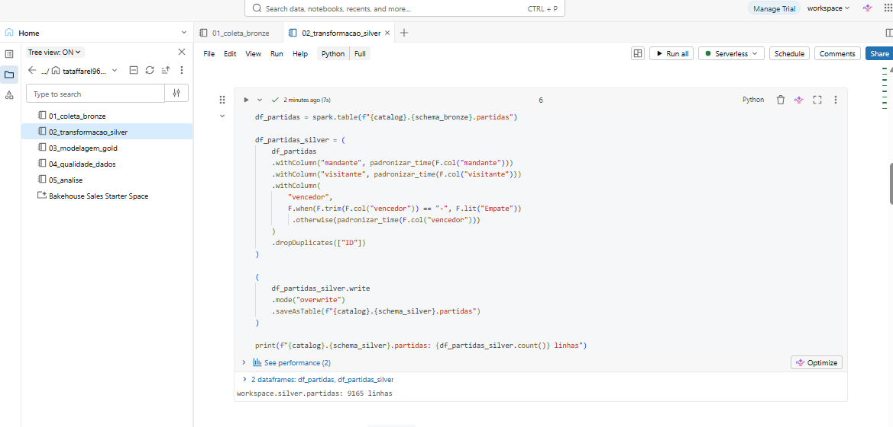

---

## Qualidade de Dados (Etapa 4.5)

Checagens realizadas no notebook [`notebooks/04_qualidade_dados.py`](notebooks/04_qualidade_dados.py):

**Completude**: as colunas-chave de todas as tabelas (identificadores, times, datas, placares) não têm nenhum valor nulo. Os nulos relevantes encontrados são pontuais e explicáveis pela natureza do dado, não por erro de coleta:
- `partidas.formacao_mandante` / `formacao_visitante`: 54,28% nulos — esquema tático não era registrado em boa parte das temporadas mais antigas.
- `gols.tipo_de_gol`: 88,05% nulos — só é preenchido para gols "especiais" (pênalti, contra etc.).
- `cartoes.atleta` (0,03%), `num_camisa` (1,84%) e `posicao` (5,72%): pequenas lacunas de preenchimento.

Nenhum desses nulos afeta as perguntas de negócio, já que elas usam principalmente times, placares e datas — colunas 100% completas.

**Unicidade**: confirmado 0 IDs de partida duplicados em `partidas` — `ID` é uma chave primária confiável.

**Consistência (nomes de times)**: não foram encontradas divergências de grafia entre as tabelas — todo nome usado em `gols`/`cartoes` também existe em `partidas`, com a mesma grafia. Encontramos, porém, uma diferença de **cobertura temporal**: times como Ipatinga, Paysandu, Barueri, Brasiliense, Santo André, Grêmio Prudente, América-RN, São Caetano, Guarani e Náutico aparecem em `partidas` mas nunca em `gols`/`cartoes` — indício de que esses arquivos têm cobertura temporal mais recente que `partidas` (esses times jogaram principalmente entre 2003-2010). Isso é documentado como limitação: análises que cruzam `partidas` com `gols`/`cartoes` cobrem apenas o recorte temporal em que ambos os arquivos coincidem.

**Consistência (valores de `cartao`)**: confirmado apenas 2 valores — "Amarelo" (19.867 registros) e "Vermelho" (1.086 registros). Nenhum valor inesperado.

**Acurácia / Outliers**: nenhuma partida com placar negativo ou acima de 10 gols — os valores de placar estão dentro do intervalo esperado.

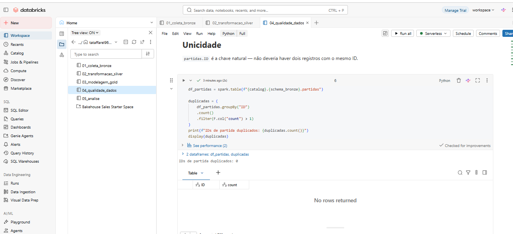

---

## Análise de Dados (Etapa 4.5)

Análise completa em [`notebooks/05_analise.py`](notebooks/05_analise.py). Resultados sobre as 9.165 partidas do Brasileirão Série A (2003 até a temporada mais recente do dataset):

**1. O mando de campo garante vantagem estatisticamente relevante?**
Mandante venceu 49,6% das partidas, contra 23,9% do visitante e 26,4% de empates. A vantagem é clara e consistente: o mandante vence mais que o dobro das vezes em relação ao visitante, ao longo de mais de duas décadas de dados.

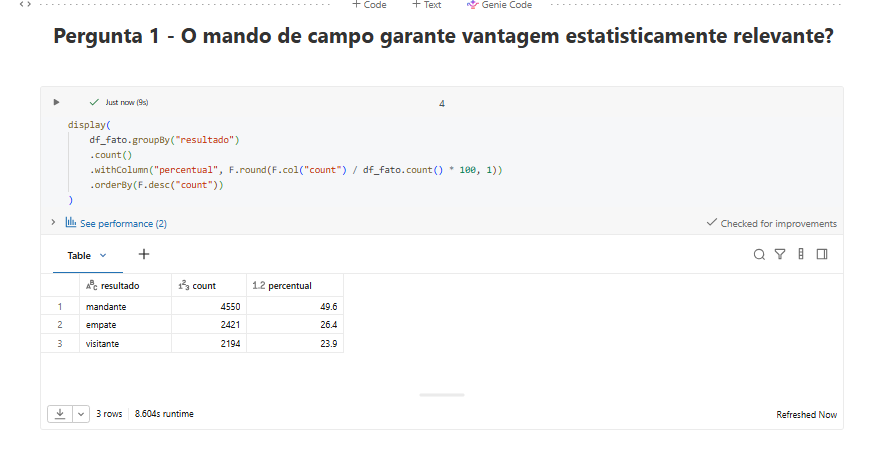

**2. Essa vantagem mudou durante 2020-2021 (jogos sem público)?**
Sim, e de forma reveladora: com público, o mandante venceu 50% das partidas; sem público (2020-2021), essa taxa caiu para 45,4% — uma queda de 4,6 pontos percentuais. A taxa de empates também subiu (de 26,2% para 29,1%). Isso sugere que parte da vantagem de mando vem do apoio da torcida, embora o mandante ainda mantivesse vantagem sobre o visitante mesmo sem público (45,4% vs. 25,5%).

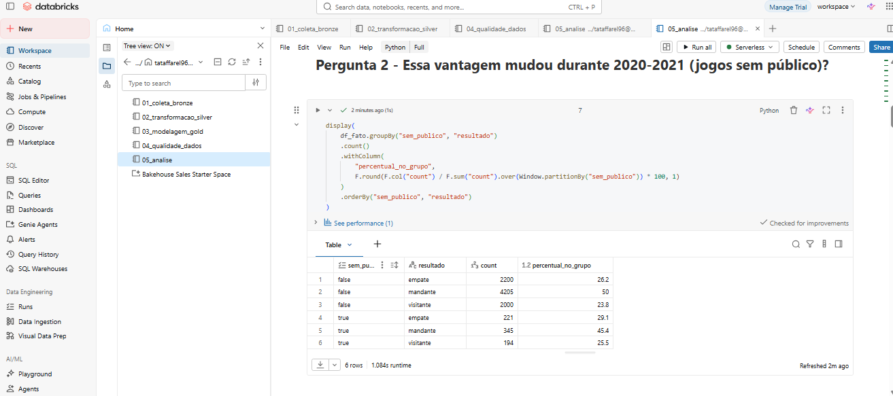

**3. Receber cartão vermelho reduz a chance de vitória?**
De forma acentuada. Quando o mandante recebe cartão vermelho, sua taxa de vitória cai de 50,7% para 27% (queda de quase 24 pontos percentuais). Quando o visitante recebe vermelho, sua taxa cai de 24,5% para 15% (queda de 9,5 pontos). O efeito é mais forte para o mandante — provavelmente porque, jogando em casa, ele tende a se lançar mais ao ataque, e ficar com um jogador a menos custa mais caro nesse contexto.

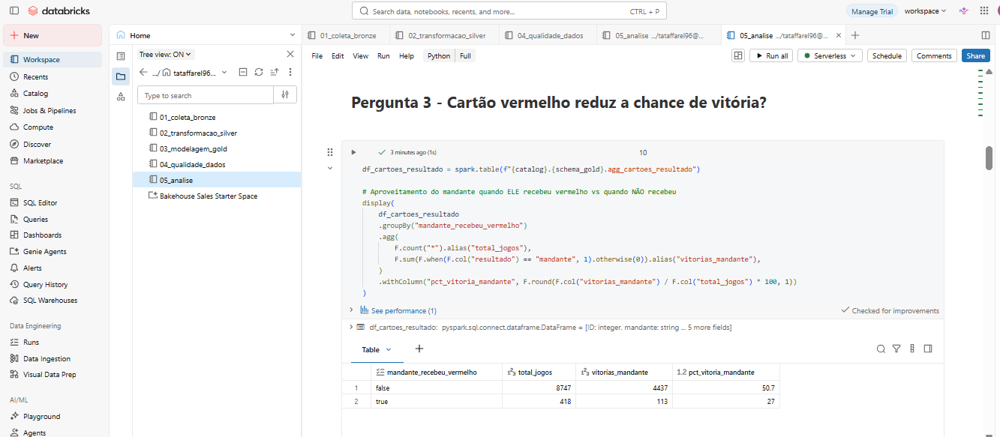

**4. Sair na frente no placar aumenta a chance de vencer?**
Sim, fortemente: quando o mandante marca o primeiro gol, vence 77,1% dessas partidas; quando o visitante marca primeiro, vence 59,3%. O dado reforça a vantagem de mando observada na pergunta 1: mesmo abrindo o placar fora de casa, o visitante converte essa vantagem em vitória com menos frequência que o mandante na mesma situação.

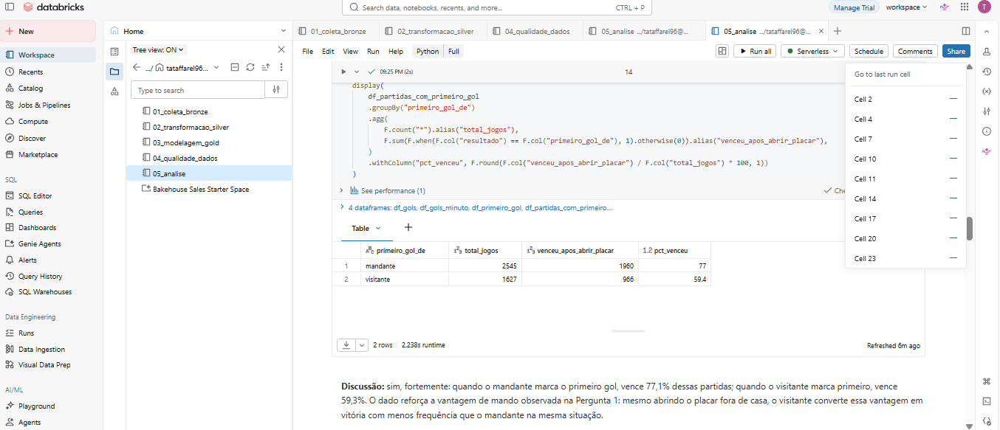

**5. Quais times têm melhor aproveitamento como mandante e como visitante?**
O ranking de aproveitamento médio em casa (considerando apenas times com pelo menos 38 jogos em casa no ano, para excluir amostras pequenas de clubes com passagens curtas pela Série A) é liderado por Grêmio (58,7%), Palmeiras (58,3%) e Internacional (58%), seguidos por São Paulo (57,7%), Flamengo (55,8%), Athletico-PR (55,5%), Santos (55,3%), Atlético-MG (54,7%), Cruzeiro (53,9%) e Corinthians (53,4%). O padrão é claro: os clubes tradicionalmente mais fortes e com maiores torcidas do futebol brasileiro concentram os melhores aproveitamentos em casa, sugerindo que a vantagem de mando é amplificada pelo poder do elenco/torcida desses clubes. Vale notar também casos como Paysandu (52,1% em casa, mas apenas 9% fora, em 67 jogos) e São Caetano (48,8% em casa vs. 25,3% fora, em 86 jogos) — clubes menores que tiveram passagens curtas pela Série A e mostram uma disparidade ainda maior entre o desempenho em casa e fora.

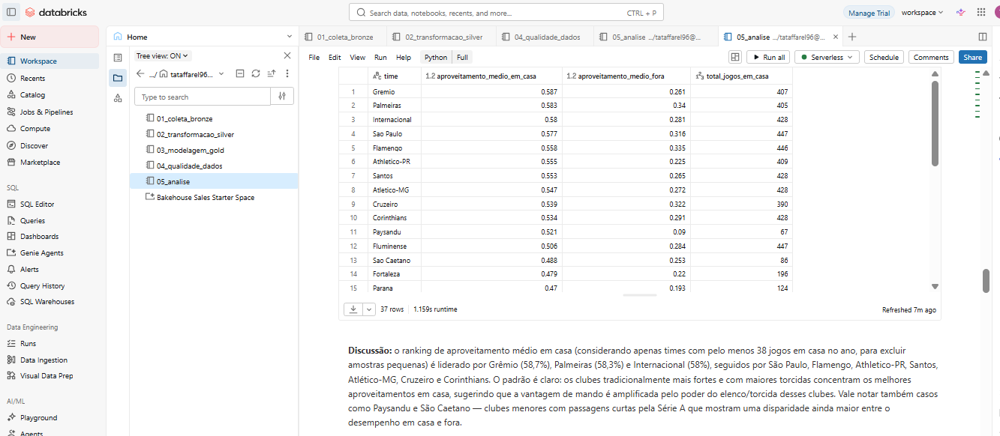

**6. A média de gols por partida mudou ao longo das temporadas?**
Sim, houve uma tendência de queda: de 2,88 gols/partida em 2003 para 2,26 em 2014, com leve recuperação depois (2,36-2,43 entre 2015-2017). Isso pode indicar uma evolução tática para um futebol mais defensivo/pragmático ao longo do tempo, embora o dado precise ser conferido também nas temporadas mais recentes do dataset para confirmar se a tendência se mantém.

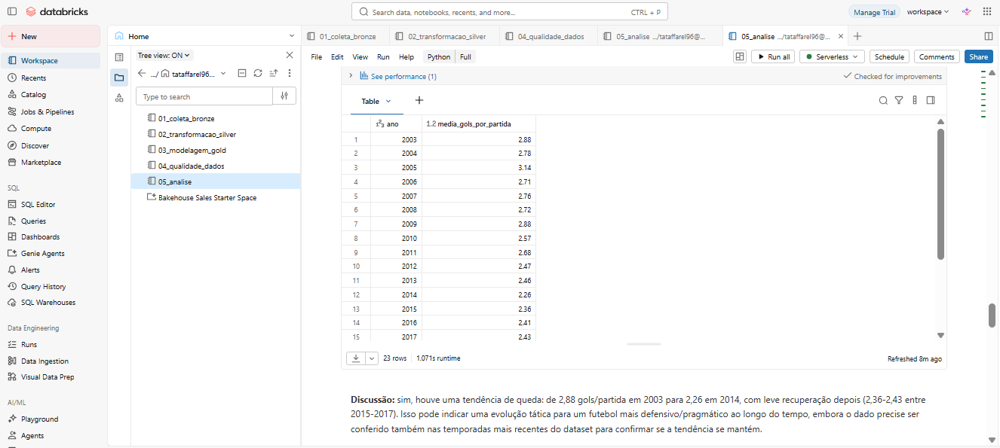

**Bônus — Posse de bola x resultado** (exploração adicional, fora das 6 perguntas originais, usando a tabela `estatisticas`): a tabela cobre as 9.165 partidas para os dois times (cobertura de junção de 100%), mas o campo `posse_de_bola` só tem valor numérico válido em 3.784 partidas (41,3%) — nas demais vem como o texto `"None"`, uma limitação de preenchimento do próprio campo, não de cobertura temporal. Dentro dessa amostra, o resultado é contraintuitivo: quando o mandante teve mais posse, venceu em apenas 43,1% dos casos — abaixo do seu aproveitamento geral de 49,6% (Pergunta 1); quando o visitante teve mais posse, venceu em 19,5% dos casos — também abaixo do seu aproveitamento geral de 23,9%. Ou seja, ter mais posse de bola não aumentou a chance de vitória de nenhum dos dois lados nesta amostra; pelo contrário, esteve associado a uma taxa de vitória menor que a média histórica de cada papel. Uma explicação plausível é que posse de bola é, em parte, sintoma de estar em desvantagem no placar (o time que está perdendo tende a ficar mais com a bola tentando o empate/virada), o que sugere que a eficiência em converter chances pode pesar mais no resultado do que o volume bruto de posse.

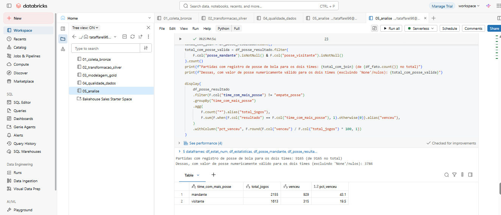

**Discussão geral:** os dados mostram que a vantagem de jogar em casa no Brasileirão é real e mensurável (quase 50% de vitórias do mandante), e que essa vantagem tem pelo menos duas fontes identificáveis: o apoio da torcida (cai quando não há público) e a superioridade técnica dos clubes tradicionalmente fortes (que dominam o ranking de aproveitamento em casa). O fator disciplinar (cartão vermelho) é o que mais isoladamente impacta o resultado — perder um jogador reduz a chance de vitória em até 24 pontos percentuais. O jogo parece ter ficado mais fechado ao longo do tempo, com menos gols por partida nas temporadas mais recentes em relação ao início dos anos 2000. E, de forma inesperada, a exploração bônus mostra que posse de bola por si só não é um bom preditor de vitória — reforçando que fatores como mando de campo e disciplina (cartões) têm um sinal mais forte sobre o resultado do que a estatística de posse.

---

## Autoavaliação

**1. Você atingiu os objetivos traçados no início?**
Sim. As 6 perguntas de negócio definidas na Etapa 1 foram respondidas com dados concretos da camada Gold, e ainda consegui ir além com uma análise bônus (posse de bola x resultado) usando a tabela `estatisticas`, que não fazia parte do escopo original. A única ressalva é a Pergunta 6 (evolução da média de gols): a tendência de queda encontrada é clara até 2014-2017, mas o dataset não cobre as temporadas mais recentes, então essa conclusão vale para o recorte temporal disponível, não necessariamente para o cenário atual do campeonato.

**2. O que você aprendeu construindo o pipeline de ponta a ponta?**
A etapa que mais me ensinou foi a transição de Bronze para Silver, exatamente porque foi onde a teoria do "dado bruto tem problema" virou prática: precisei checar o schema real das tabelas (com `printSchema()`) em vez de assumir nomes de coluna, e usar checagens de qualidade de dados para confirmar hipóteses (como se havia ou não divergência de grafia entre nomes de times) em vez de simplesmente supor. Isso deixou claro como um Engenheiro de Dados passa boa parte do tempo validando e desconfiando dos dados antes de modelar qualquer coisa. Outro ponto bem interessante, foi a forma como resolver determinados problemas encontrados e onde estamos querendo chegar com a análise. A utilização da ferramenta da qual não tinha e não tenho tanto conhecimento, fez com que eu saísse da "zona" de conforto em busca de informações e ajudas auxiliares para estar criando meu trabalho.

**3. Quais foram as principais dificuldades técnicas?**
As principais dificuldades foram: (1) alinhar os nomes de catálogo/schema/volume do Unity Catalog entre o que eu criava na interface e o que os notebooks esperavam, o que gerou erros como `NO_SUCH_CATALOG_EXCEPTION`; (2) descobrir que os nomes reais das colunas eram diferentes do que eu tinha assumido inicialmente (`mandante_Placar`/`visitante_Placar` com "P" maiúsculo, e uma coluna chamada `rodata` em vez de `rodada`); e (3) um erro de cast (`CAST_INVALID_INPUT`) na análise bônus de posse de bola, causado pelo modo ANSI do Databricks recusando converter o texto literal `"None"` para número — resolvido usando `try_cast` em vez de `.cast()`. Outra dificuldade encontrada foi a falta de conhecimento com a plataforma, sendo necessário buscas auxiliares em youtube, IA e até mesmo conhecidos familiarizados com o tipo de problema detalhado para apoios na criação dos modelos.

**4. Os dados tinham alguma limitação que afetou a análise?**
Sim, duas limitações relevantes. A primeira é uma diferença de cobertura temporal entre `partidas` e as tabelas `gols`/`cartoes`: times como Ipatinga, Paysandu e outros aparecem em `partidas` mas nunca em `gols`/`cartoes`, o que indica que esses arquivos cobrem um recorte de temporadas mais recente. A segunda é o preenchimento do campo `posse_de_bola` na tabela `estatisticas`, válido em apenas 41,3% das partidas — o que limita (mas não invalida) a análise bônus de posse de bola. Ambas as limitações foram documentadas explicitamente no README e nos notebooks, em vez de ignoradas.

**5. O que você faria diferente se fosse recomeçar o trabalho hoje?**
Investigaria o schema real de todas as tabelas (via `printSchema()` e um `describe`/`display` inicial) logo na etapa de Coleta, antes de escrever qualquer lógica de transformação — isso teria evitado boa parte do retrabalho nos notebooks de Silver e Gold, que precisaram ser ajustados depois que os nomes reais de coluna vieram à tona.

**6. Quais seriam os próximos passos para evoluir esse MVP?**
Aprofundar a análise de posse de bola cruzando com outras métricas da tabela `estatisticas` (chutes no alvo, escanteios, precisão de passe) para entender melhor por que posse sozinha não prediz vitória; trazer temporadas mais recentes do campeonato para validar se a tendência de queda nos gols por partida se mantém; e transformar as tabelas Gold em um dashboard (por exemplo, no próprio Databricks ou em uma ferramenta de BI) para consulta interativa dos resultados.

